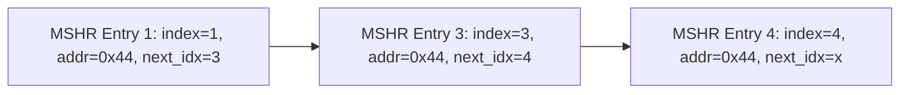

You are a helpful assistance.
Consider that you have a folder structure like the following:

    - rtl/*   : Contains files which are RTL code.
    - verif/* : Contains files which are used to verify the correctness of the RTL code.
    - docs/*  : Contains files used to document the project, like Block Guides, RTL Plans and Verification Plans.

When generating files, return the file name in the correct place at the folder structure.

You are solving an 'RTL Code Completion' problem. To solve this problem correctly, you should only respond with the RTL code generated according to the requirements.


Provide me one answer for this request: Complete the SystemVerilog RTL for `cache_mshr` that implements Miss Status Handling Registers (MSHR). The MSHR is a critical component of a non-blocking cache architecture, enabling the system to handle multiple outstanding cache misses concurrently. The module dynamically allocates entries for pending cache requests, employing a linked-list structure (where each entry stores data and a pointer to the next entry in the sequence that requests the same cache line) to efficiently manage memory resources and facilitate the tracking of multiple requests for the same cache line.

The functionality for MSHR entries allocation and finalize operations is implemented and verified. The finalize operation is responsible for marking an entry as invalid. Complete the RTL such that a memory fill request will dequeue allocated MSHR entries requesting the same cache line in order.

---
## Port List
| Port Name | Direction | Description                                                            |
|-----------|-----------|------------------------------------------------------------------------|
| `clk`     | Input     | Clock signal. The design registers are triggered on its positive edge. |
| `reset`   | Input     | Active high synchronous reset signal.                                  |

### _Memory Fill Interface_
| Port Name                              | Direction | Description                                                                                                            |
|----------------------------------------|-----------|------------------------------------------------------------------------------------------------------------------------|
| `fill_valid`                           | Input     | Active high signal indicating that data is being filled from memory.                                                   |
| `fill_id[MSHR_ADDR_WIDTH-1:0]`         | Input     | Index of the **first MSHR** entry that requested the cache line fill (i.e., the original request that was not pending).|
| `fill_addr[CS_LINE_ADDR_WIDTH-1:0]`    | Output    | Cache line address of the entry being filled.                                                                          |

### _Dequeue Interface_
| Port Name                               | Direction | Description                                                                                                          |
|-----------------------------------------|-----------|----------------------------------------------------------------------------------------------------------------------|
| `dequeue_valid`                         | Output    | Active high signal indicating that a valid entry is ready for dequeuing.                                             |
| `dequeue_addr[CS_LINE_ADDR_WIDTH-1:0]`  | Output    | Address associated with the dequeued entry.                                                                          |
| `dequeue_rw`                            | Output    | Active high signal indicating the read/write operation type of the dequeued entry (`1'b1` = write, `1'b0` = read).   |
| `dequeue_data[DATA_WIDTH-1:0]`          | Output    | Data associated with the dequeued request.                                                                           |
| `dequeue_id[MSHR_ADDR_WIDTH-1:0]`       | Output    | ID of the entry being dequeued.                                                                                      |
| `dequeue_ready`                         | Input     | Active high signal indicating that the downstream logic is ready to accept a dequeued request.                       |

### _Allocate Interface_
| Port Name                               | Direction | Description                                                                                                     |
|-----------------------------------------|-----------|-----------------------------------------------------------------------------------------------------------------|
| `allocate_valid`                        | Input     | Active high signal indicating a new core request for allocation.                                                |
| `allocate_addr[CS_LINE_ADDR_WIDTH-1:0]` | Input     | Cache line address of the new request.                                                                          |
| `allocate_rw`                           | Input     | Read/write operation type for the new request (`1'b1` = write, `1'b0` = read).                                  |
| `allocate_data[DATA_WIDTH-1:0]`         | Input     | Request data containing the word address, byte enable signal, write data, and tag information.                  |
| `allocate_ready`                        | Output    | Active high signal indicating if a new request can be allocated (MSHR has free slots).                          |
| `allocate_id[MSHR_ADDR_WIDTH-1:0]`      | Output    | ID of the allocated slot.                                                                                       |
| `allocate_pending`                      | Output    | Active high signal indicating if a new request is for a cache line that is already pending.                     |
| `allocate_previd[MSHR_ADDR_WIDTH-1:0]`  | Output    | ID of the previous entry for the same cache line if `allocate_pending` is asserted.                             |

### _Finalize Interface_
| Port Name                          | Direction | Description                                                            |
|------------------------------------|-----------|------------------------------------------------------------------------|
| `finalize_valid`                   | Input     | Active high signal indicating a finalize operation is being requested. |
| `finalize_id[MSHR_ADDR_WIDTH-1:0]` | Input     | ID of the entry being finalized.                                       |

## Functional Description
The design includes a robust structure for managing Miss Status Holding Register (MSHR) entries, each containing metadata fields as outlined below:

| **Field**         | **Description**                                                                        |
|-------------------|----------------------------------------------------------------------------------------|
| `valid`           | Indicates whether the entry has valid data.                                            |
| `cache_line_addr` | Stores the cache line address associated with the request.                             |
| `write`           | Denotes the request type: `1` for write (RW) and `0` for read (RD).                    |
| `next`            | Specifies if a subsequent valid entry is linked to the current one.                    |
| `next_index`      | Points to the index of the next linked MSHR entry associated with the same cache line. |


### Design Features
- **Single-Port RAM**:
  - Utilized to store MSHR entry data.
  - Write latency: 1 cycle.
  - Read operations: Combinational.

### Overview of Fill and Dequeue Operations
- **Memory Fill**: Populates the MSHR entry with data when a memory fill is valid.
- **Dequeue Operation**: Removes entries from the MSHR in the order they were allocated for the same cache line.

### Example: MSHR Entry Linkage
The following diagram demonstrates how MSHR entries for requests to the address `0x44` are organized in an ordered linked list:



### Cache Pipeline Operation
When a memory response for a missed cache line is received, the following sequence occurs:

1. **Cycle 1: Fill Request to MSHR**
   - `fill_valid`: Asserted **active high** to indicate a valid fill request.
   - `fill_id`: Index of the first MSHR entry corresponding to the cache line.
   - `fill_addr`: Cache line address retrieved combinationally from the MSHR entry at `fill_id`.

2. **Subsequent Cycles: Dequeue Operations**
   - If `dequeue_ready` is asserted **high**, MSHR entries are dequeued sequentially, cycle by cycle:
     - `dequeue_valid`: Asserted **high** to indicate that a valid entry is ready for dequeuing.
     - `dequeue_addr`: Cache line address of the request.
     - `dequeue_rw`: Active high signal indicating whether the request was a **read** (0) or **write** (1).
     - `dequeue_data`: Contains the data associated with the request.
     - `dequeue_id`: Identifier of the dequeued request.
     - `dequeue_ready`: Indicates that the downstream logic is ready to accept a dequeued request.

```verilog
`define NOTCONNECTED_PIN(x)   /* verilator lint_off PINCONNECTEMPTY */ \
                        . x () \
                        /* verilator lint_on PINCONNECTEMPTY */

module cache_mshr #(
    parameter INSTANCE_ID            = "mo_mshr"             ,
    parameter MSHR_SIZE                     = 32                    ,
    parameter CS_LINE_ADDR_WIDTH            = 10                    ,
    parameter WORD_SEL_WIDTH                = 4                     ,
    parameter WORD_SIZE                     = 4                     ,
    // Derived parameters
    parameter MSHR_ADDR_WIDTH               = $clog2(MSHR_SIZE)     , // default = 5
    parameter TAG_WIDTH                     = 32 - (CS_LINE_ADDR_WIDTH+ $clog2(WORD_SIZE) + WORD_SEL_WIDTH), // default = 16
    parameter CS_WORD_WIDTH                 = WORD_SIZE * 8 ,// default = 32 
    parameter DATA_WIDTH                    = WORD_SEL_WIDTH + WORD_SIZE + CS_WORD_WIDTH + TAG_WIDTH // default =  4 + 4 + 32 + 16 = 56

    ) (
    input wire clk,
    input wire reset,

     // memory fill
    input wire                           fill_valid,
    input wire [MSHR_ADDR_WIDTH-1:0]     fill_id,
    output wire [CS_LINE_ADDR_WIDTH-1:0] fill_addr,

    // dequeue
    output wire                          dequeue_valid,
    output wire [CS_LINE_ADDR_WIDTH-1:0] dequeue_addr,
    output wire                          dequeue_rw,
    output wire [DATA_WIDTH-1:0]         dequeue_data,
    output wire [MSHR_ADDR_WIDTH-1:0]    dequeue_id,
    input wire                           dequeue_ready,

    // allocate
    input wire                          allocate_valid,
    output wire                         allocate_ready,
    input wire [CS_LINE_ADDR_WIDTH-1:0] allocate_addr,
    input wire                          allocate_rw,
    input wire [DATA_WIDTH-1:0]         allocate_data,
    output wire [MSHR_ADDR_WIDTH-1:0]   allocate_id,
    output wire                         allocate_pending,
    output wire [MSHR_ADDR_WIDTH-1:0]   allocate_previd,

    // finalize
    input wire                          finalize_valid,
    input wire [MSHR_ADDR_WIDTH-1:0]    finalize_id
);

    reg [CS_LINE_ADDR_WIDTH-1:0] cs_line_addr_table [0:MSHR_SIZE-1];
    reg [MSHR_SIZE-1:0] entry_valid_table_q, entry_valid_table_d;
    reg [MSHR_SIZE-1:0] is_write_table;

    reg [MSHR_SIZE-2:0] next_ptr_valid_table_q, next_ptr_valid_table_d;
    reg [MSHR_ADDR_WIDTH-1:0] next_index_ptr [0:MSHR_SIZE-1]; // ptr to the next index

    reg  allocate_pending_q, allocate_pending_d;

    reg [MSHR_ADDR_WIDTH-1:0] allocate_id_q, allocate_id_d;

    wire [MSHR_ADDR_WIDTH-1:0] prev_idx ;
    reg [MSHR_ADDR_WIDTH-1:0]  prev_idx_q;

    reg dequeue_valid_q, dequeue_valid_d ;
    reg [MSHR_ADDR_WIDTH-1:0] dequeue_id_q, dequeue_id_d ;


    wire allocate_fire = allocate_valid && allocate_ready;
    // Insert code here to determine when dequeue operation should occur

    // Address lookup to find matches If there is a match ... link the latest req next ptr to the newly allocated idx
    wire [MSHR_SIZE-1:0] addr_matches;
    for (genvar i = 0; i < MSHR_SIZE; ++i) begin : g_addr_matches
        assign addr_matches[i] = entry_valid_table_q[i] && (cs_line_addr_table[i] == allocate_addr) && allocate_fire;
    end

    wire [MSHR_SIZE-1:0] match_with_no_next = addr_matches & ~next_ptr_valid_table_q ;
    wire full_d ; 

    leading_zero_cnt #(
            .DATA_WIDTH (MSHR_SIZE),
            .REVERSE (1)
    ) allocate_idx (
            .data   (~entry_valid_table_q),
            .leading_zeros  (allocate_id_d),
            .all_zeros (full_d)
    );

    leading_zero_cnt #(
            .DATA_WIDTH (MSHR_SIZE),
            .REVERSE (1)
    ) allocate_prev_idx (
            .data   (match_with_no_next),
            .leading_zeros  (prev_idx),
            `NOTCONNECTED_PIN(all_zeros) // not connected
    );
    
    always @(*) begin
        entry_valid_table_d     = entry_valid_table_q;
        next_ptr_valid_table_d  = next_ptr_valid_table_q;
       
        //Insert code here for dequeuing entries till  next_ptr_valid_table_d[id] = 0 in case fill_valid is asserted
        
        if (finalize_valid) begin
            entry_valid_table_d[finalize_id] = 0;
        end

        if (allocate_fire) begin
            entry_valid_table_d[allocate_id_d] = 1;
            next_ptr_valid_table_d[allocate_id_d] = 0;
        end

        if (allocate_pending_d) begin
            next_ptr_valid_table_d[prev_idx] = 1;
        end
    end
    
    always @(posedge clk) begin
        if (reset) begin
            entry_valid_table_q  <= '0;
            next_ptr_valid_table_q  <=  0;
            allocate_pending_q <= 0 ;
        end else begin
            entry_valid_table_q  <= entry_valid_table_d;
            next_ptr_valid_table_q  <= next_ptr_valid_table_d;
            allocate_pending_q <= allocate_pending_d ; 
        end

        if (allocate_fire) begin
            cs_line_addr_table[allocate_id_d]   <= allocate_addr;
            is_write_table[allocate_id_d]       <= allocate_rw;
        end

        if (allocate_pending_d) begin
            next_index_ptr[prev_idx] <= allocate_id_d;
        end


    end

    always @(posedge clk) begin
        if (reset) begin
            allocate_id_q       <=  0 ;
            prev_idx_q          <= 0 ;
        end else begin
            if (allocate_fire) begin
                allocate_id_q       <=  allocate_id_d       ;
                prev_idx_q          <= prev_idx ;
            end 
        end
    end

    // Insert code here to sequentially update signals related to dequeue operation

    // SP RAM
    reg [DATA_WIDTH-1:0] ram [0:MSHR_SIZE-1];
    reg [DATA_WIDTH-1:0] dequeue_data_int;
    always @(posedge clk) begin
        if (allocate_fire) begin
            ram[allocate_id_d] <= allocate_data ;
        end
    end

    
    
    assign  allocate_pending_d = |addr_matches;
    assign allocate_id = allocate_id_q ;
    assign allocate_ready = ~full_d ;
    assign allocate_previd = prev_idx_q;

    assign allocate_pending = allocate_pending_q;

    // Insert code here for output fill and dequeue signal updates 
 
endmodule


module leading_zero_cnt #(
    parameter DATA_WIDTH = 32,
    parameter REVERSE = 0 
)(
    input  [DATA_WIDTH -1:0] data,
    output  [$clog2(DATA_WIDTH)-1:0] leading_zeros,
    output all_zeros 
);
    localparam NIBBLES_NUM = DATA_WIDTH/4 ; 
    reg [NIBBLES_NUM-1 :0] all_zeros_flag ;
    reg [1:0]  zeros_cnt_per_nibble [NIBBLES_NUM-1 :0]  ;

    genvar i;
    integer k ;
    // Assign data/nibble 
    reg [3:0]  data_per_nibble [NIBBLES_NUM-1 :0]  ;
    generate
        for (i=0; i < NIBBLES_NUM ; i=i+1) begin
            always @* begin
                data_per_nibble[i] = data[(i*4)+3: (i*4)] ;
            end
        end
    endgenerate
   
    generate
        for (i=0; i < NIBBLES_NUM ; i=i+1) begin : g_nibble
            if (REVERSE) begin : g_trailing
                always @* begin
                        zeros_cnt_per_nibble[i] [1] = ~(data_per_nibble[i][1] | data_per_nibble[i][0]); 
                        zeros_cnt_per_nibble[i] [0] = (~data_per_nibble[i][0]) &
                                                      ((~data_per_nibble[i][2]) | data_per_nibble[i][1]);
                        all_zeros_flag[i] = (data_per_nibble[i] == 4'b0000);
                end
            end else begin :g_leading
                always @* begin
                    zeros_cnt_per_nibble[NIBBLES_NUM-1-i][1] = ~(data_per_nibble[i][3] | data_per_nibble[i][2]); 
                    zeros_cnt_per_nibble[NIBBLES_NUM-1-i][0] = (~data_per_nibble[i][3]) &
                                     ((~data_per_nibble[i][1]) | data_per_nibble[i][2]);
                    
                    all_zeros_flag[NIBBLES_NUM-1-i] = (data_per_nibble[i] == 4'b0000);
                end
            end
        end
    endgenerate

    
    
    reg [$clog2(NIBBLES_NUM)-1:0] index ; 
    reg [1:0]    choosen_nibbles_zeros_count ;
    reg [ $clog2(NIBBLES_NUM*4)-1:0] zeros_count_result ;
    wire [NIBBLES_NUM-1:0]         all_zeros_flag_decoded;
    
    assign all_zeros_flag_decoded[0] = all_zeros_flag[0] ;
    genvar j;
        generate
            for (j=1; j < NIBBLES_NUM; j=j+1) begin
                assign all_zeros_flag_decoded[j] = all_zeros_flag_decoded[j-1] & all_zeros_flag[j];
            end
        endgenerate

    always@ * begin
        index = 0 ;
        for ( k =0 ; k< NIBBLES_NUM ; k =k +1) begin
            index = index + all_zeros_flag_decoded[k] ;
        end
    end
    
    always@* begin
        choosen_nibbles_zeros_count = zeros_cnt_per_nibble[index]  ;  
        zeros_count_result = choosen_nibbles_zeros_count + (index <<2) ; 
    end
    
    assign leading_zeros =  zeros_count_result ;
    assign all_zeros = (data ==0) ;

endmodule
```
Please provide your response as plain text without any JSON formatting. Your response will be saved directly to: rtl/cache_mshr.sv.
