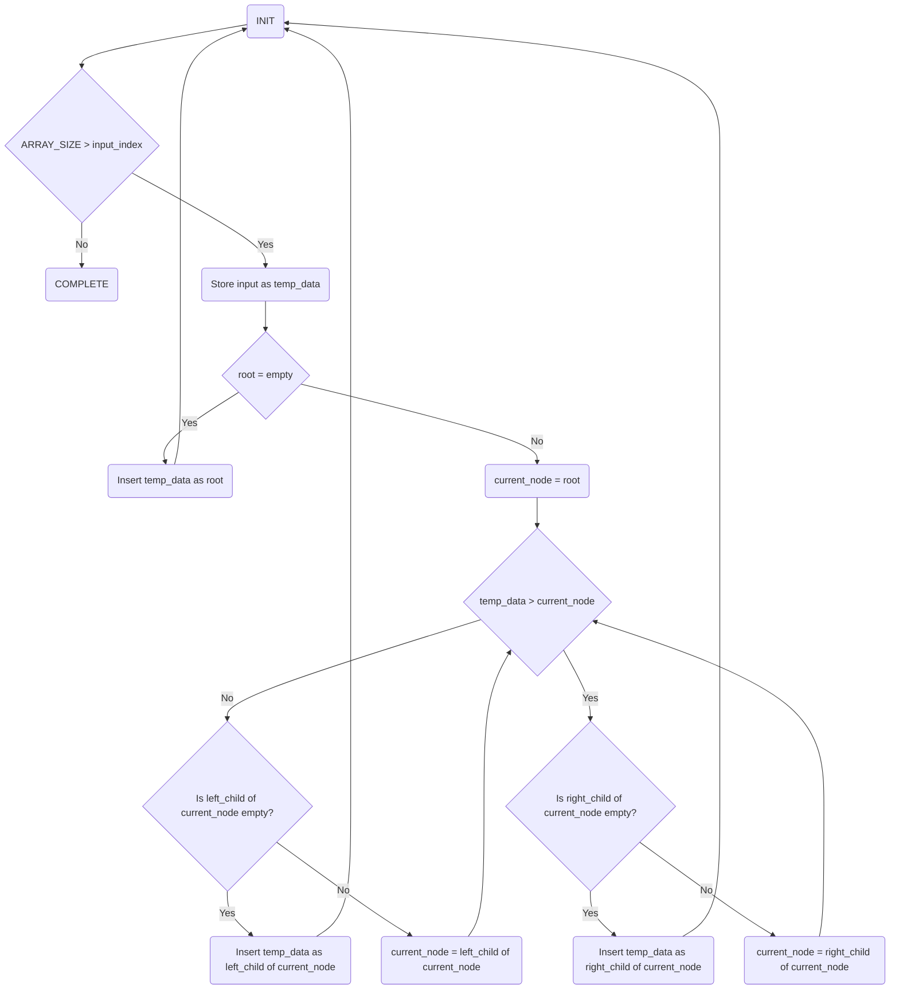

You are a helpful assistance.
Consider that you have a folder structure like the following:

    - rtl/*   : Contains files which are RTL code.
    - verif/* : Contains files which are used to verify the correctness of the RTL code.
    - docs/*  : Contains files used to document the project, like Block Guides, RTL Plans and Verification Plans.

When generating files, return the file name in the correct place at the folder structure.

You are solving an 'RTL Code Completion' problem. To solve this problem correctly, you should only respond with the RTL code generated according to the requirements.


Provide me one answer for this request: Complete the partial SystemVerilog code for a binary search tree (BST)-based sorting algorithm that processes an array of unsigned integers with a parameterizable size, ARRAY_SIZE (number of elements in the array, will be greater than 0). A BST is a data structure where each node has a key, and its left child contains keys less than the node, while its right child contains keys greater than the node and thereby constructs a tree. The algorithm should organize the integers into a binary search tree and traverse the tree to produce a sorted output array. The maximum data value possible for an element within the array can be set with the parameter DATA_WIDTH (width of a single element, greater than 0). The module is driven by a clock(`clk`), has an asynchronous active high reset mechanism(`reset`) to reset all outputs to zero, and provides active high control signals (1 clock cycle in duration) to indicate when sorting should start (`start`) and when it is completed (`done`). Any change in the input array (`data_in`) in the middle of the operation must not be considered and the earlier value of the `data_in` must be retained. Sorting should arrange the elements of the array in ascending order, such that the smallest element is at index 0 and the largest element is at index ARRAY_SIZE-1. `sorted_out` holds the sorted array when the `done` signal asserts high. Both  `done` and `sorted_out` are set to 0 after 1 clock cycle.

In the code below, the BST-based sorting algorithm is implemented with a Hierarchical Finite State Machine (HFSM) that controls the traversal and modification of the tree structure synchronized on the rising edge of the clock signal. The HFSM approach divides the sorting process into manageable sub-tasks, with a top-level FSM coordinating subordinate FSMs and managing transitions between the main processes:

For the implementation of BST-based sorting, the Top-Level FSM consists of three different FSMs: 

1. IDLE: Initializes all variables and arrays, resetting the system to its default state. When the start is asserted, it transitions to BUILD_TREE.
2. BUILD_TREE: Constructs the binary tree by inserting data sequentially, from the input array. After all data is processed, it transitions to SORT_TREE.
3. SORT_TREE: Retrieves sorted data from the constructed by performing an in-order traversal of the binary tree to output sorted keys, managing traversal using a stack-based approach.
 
#### Instructions to complete the given code:  
Complete the logic for BUILD_TREE and SORT_TREE states of the Top-Level FSM.

1. **BUILD_TREE FSM:**  The finite state machine (FSM) responsible for constructing a binary search tree (BST) operates in a sequence of states to build the tree from an unsorted array. Each number in the array is processed one at a time. The flow diagram below describes the algorithm for building the tree. For each node comparison with the current_node (the node to be traversed and checked for insertion of the new node), the algorithm decides whether to move left or right. If the chosen child pointer is NULL, it inserts the new key there, and if the child node already exists, the current_node is updated to that child so the process can repeat until a NULL position is found.

      **Latency analysis of missing code sections for the BUILD_TREE FSM:**
     Building the BST involves inserting numbers and traversing the tree. Each state in the FSM performs a distinct task:

      - **Loading input**: Reading each number from the input array until it reaches the end of an array requires one clock cycle. After the last element in the array is inserted, it takes one additional clock cycle to go to the COMPLETE state to start the sorting process. 
      - **Root node insertion:** If the tree is empty, inserting the root node takes one clock cycle. Otherwise, the root node is assigned to the current_node for each node, which also takes one clock cycle.
      - **Node comparison and Tree traversal:** Each comparison (whether the number should go to the left or right child) takes one clock cycle if the current_node has no child. Otherwise, traversing to the next level in the tree to find a NULL position takes N clock cycles, where N is the depth of the tree. This process continues until the correct position is found, and the node is inserted.



2. **SORT_TREE FSM:** This FSM handles sorting an array by traversing a previously constructed binary search tree (BST) and producing a sorted array as output. The FSM uses a stack and stack pointer (`sp`) to efficiently manage the recursive in-order traversal of the tree. The traversal begins with the left subtree of the root node, continues by processing and storing the current_node, and finally explores the right subtree.

    **Latency analysis of missing code sections for the SORT_TREE FSM:**
    Sorting the array requires an in-order traversal of the BST:

     - **Initialization:** Checking if the root is not NULL and assigning the root to the current_node takes one clock cycle. 
     - **Left Subtree Traversal:** The latency is proportional to the depth of the tree, as the FSM moves down the left subtree until it reaches a node with no left child. This requires N clock cycles, where N is the depth of the leftmost node. For the nodes for which left_child is NULL, it takes an additional clock cycle to proceed toward the next state for the popping operation. 
     - **Processing and Output:** Once the leftmost node is reached, popping the stack and storing the value as output takes one additional clock cycle per node. When all the nodes in the tree are traversed, an additional clock cycle is required to set the outputs.
    - **Right Subtree Traversal:** For each node in the left subtree, its right child is checked. This operation takes two clock cycles (one to update the current_node with the right child and one to check if it exists).  If the right child exists, the FSM recursively traverses its left subtree as described in the `Left Subtree Traversal` section, further adding additional latency proportional to the depth of the right child’s leftmost node. If the right child doesn't exist, it tasks one clock cycle to move to the next state to further process the nodes currently on the stack.
    

###  Example: Take an example for the array with a reverse sorted list (in descending order):

- Latency for BUILD_TREE:  For any node, 2 * ARRAY_SIZE is the total latency for all nodes for initialization, and insertion. For the reverse sorted list, each node except the root node traverses until its current depth where no further child is found. That means for key at the 1st index (of the input array) it traverses up to depth 1, for the key at 2nd index, it traverses up to depth 2, and so on. So the total latency for traversing through left subtree is (ARRAY_SIZE -1) * ARRAY_SIZE / 2. It must take 2 additional clock cycles after building the tree to go back to the initialization to check if all the nodes are traversed and to go to the COMPLETE state to initialize SORT_TREE. 

  Total Latency for BUILD_TREE = ((ARRAY_SIZE - 1) * ARRAY_SIZE)/2 + 2 * ARRAY_SIZE +  2

- Latency for SORT_TREE:  Initializing the root node takes one clock cycle. Traversing the left subtree takes ARRAY_SIZE clock cycles as the numbers are already sorted in descending order. An additional clock cycle is required for the last node for which no left child exists. Each node must take 3 clock cycles (store output + assign right child + check for right child). As for this example, the leftmost node in the left subtree has no further left child, one additional clock cycle is required. 

   Total latency for SORT_TREE =  1 + ARRAY_SIZE + 1 + 3 * ARRAY_SIZE  + 1
 
```verilog
module binary_search_tree_sort #(
    parameter DATA_WIDTH = 32,
    parameter ARRAY_SIZE = 8
) (
    input clk,
    input reset,
    input reg [ARRAY_SIZE*DATA_WIDTH-1:0] data_in, // Input data to be sorted
    input start,
    output reg [ARRAY_SIZE*DATA_WIDTH-1:0] sorted_out, // Sorted output
    output reg done
);

    // Parameters for top-level FSM states
    parameter IDLE = 2'b00, BUILD_TREE = 2'b01, SORT_TREE = 2'b10;

    // Insert code here to declare the parameters for the FSM states to be implemented

    // Registers for FSM states
    reg [1:0] top_state, build_state, sort_state;

    // BST representation
    reg [ARRAY_SIZE*DATA_WIDTH-1:0] keys; // Array to store node keys
    reg [ARRAY_SIZE*($clog2(ARRAY_SIZE)+1)-1:0] left_child; // Left child pointers
    reg [ARRAY_SIZE*($clog2(ARRAY_SIZE)+1)-1:0] right_child; // Right child pointers
    reg [$clog2(ARRAY_SIZE):0] root; // Root node pointer
    reg [$clog2(ARRAY_SIZE):0] next_free_node; // Pointer to the next free node

    // Stack for in-order traversal
    reg [ARRAY_SIZE*($clog2(ARRAY_SIZE)+1)-1:0] stack; // Stack for traversal
    reg [$clog2(ARRAY_SIZE):0] sp; // Stack pointer  

    // Working registers
    reg [$clog2(ARRAY_SIZE):0] current_node; // Current node being processed
    reg [$clog2(ARRAY_SIZE):0] input_index; // Index for input data
    reg [$clog2(ARRAY_SIZE):0] output_index; // Index for output data
    reg [DATA_WIDTH-1:0] temp_data; // Temporary data register

    // Initialize all variables
    integer i;

    always @(posedge clk or posedge reset) begin
        if (reset) begin
            // Reset all states and variables
            top_state <= IDLE;
            build_state <= INIT;
            sort_state <= S_INIT;
            
            root <= {($clog2(ARRAY_SIZE)+1){1'b1}}; ; // Null pointer
            next_free_node <= 0;
            sp <= 0;
            input_index <= 0;
            output_index <= 0;
            done <= 0;

            // Clear tree arrays
            for (i = 0; i < ARRAY_SIZE; i = i + 1) begin
                keys[i*DATA_WIDTH +: DATA_WIDTH] <= 0;
                left_child[i*($clog2(ARRAY_SIZE)+1) +: ($clog2(ARRAY_SIZE)+1)] <= {($clog2(ARRAY_SIZE)+1){1'b1}}; 
                right_child[i*($clog2(ARRAY_SIZE)+1) +: ($clog2(ARRAY_SIZE)+1)] <= {($clog2(ARRAY_SIZE)+1){1'b1}};
                stack[i*($clog2(ARRAY_SIZE)+1) +: ($clog2(ARRAY_SIZE)+1)] <= {($clog2(ARRAY_SIZE)+1){1'b1}};
            end

        end else begin
            case (top_state)
                IDLE: begin
                    done <= 0;
                    input_index <= 0;
                    output_index <= 0; 
                    root <= {($clog2(ARRAY_SIZE)+1){1'b1}}; ; // Null pointer
                    next_free_node <= 0;
                    sp <= 0;
                    for (i = 0; i < ARRAY_SIZE+1; i = i + 1) begin
                        keys[i*DATA_WIDTH +: DATA_WIDTH] <= 0;
                        left_child[i*($clog2(ARRAY_SIZE)+1) +: ($clog2(ARRAY_SIZE)+1)] <= {($clog2(ARRAY_SIZE)+1){1'b1}}; 
                        right_child[i*($clog2(ARRAY_SIZE)+1) +: ($clog2(ARRAY_SIZE)+1)] <= {($clog2(ARRAY_SIZE)+1){1'b1}};
                        stack[i*($clog2(ARRAY_SIZE)+1) +: ($clog2(ARRAY_SIZE)+1)] <= {($clog2(ARRAY_SIZE)+1){1'b1}};
                    end
                    if (start) begin
                        // Load input data into input array
                        top_state <= BUILD_TREE;
                        build_state <= INIT;
                    end
                end

                BUILD_TREE: begin
                    case (build_state)

                           // Insert code here to implement storing of the number to be inserted from the array, insertion of the root, and traversing the tree to find the correct position of the number to be inserted based on the node with no child. 

                        COMPLETE: begin
                            // Tree construction complete
                            top_state <= SORT_TREE;
                            sort_state <= S_INIT;
                        end

                    endcase
                end

                SORT_TREE: begin
                    case (sort_state)
                    
                         // Insert code here to implement the sorting by handling the left child of the current_node, storing the output, and then further processing the right child of the current_node.

                    endcase
                end
            endcase
        end
    end
endmodule
```
Please provide your response as plain text without any JSON formatting. Your response will be saved directly to: rtl/binary_search_tree_sort.sv.
