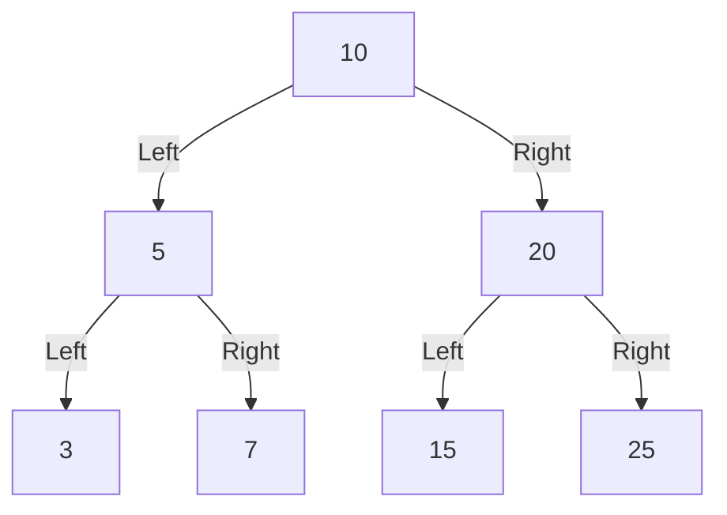

You are a helpful assistance.
Consider that you have a folder structure like the following:

    - rtl/*   : Contains files which are RTL code.
    - verif/* : Contains files which are used to verify the correctness of the RTL code.
    - docs/*  : Contains files used to document the project, like Block Guides, RTL Plans and Verification Plans.

When generating files, return the file name in the correct place at the folder structure.

You are solving an 'RTL Code Completion' problem. To solve this problem correctly, you should only respond with the RTL code generated according to the requirements.


Provide me one answer for this request: Complete the partial SystemVerilog code for a `search_binary_search_tree` module. This module performs a search for a given `search_key` in a binary search tree (BST) which is given as an array of unsigned integers with a parameterizable size, `ARRAY_SIZE` (greater than 0). 

The BST is a structure formed where each node contains a key, with its `left_child` containing `keys` less than the node, and its `right_child` containing `keys` greater than the node. The module should locate the position of the `search_key` in the array sorted with the constructed BST. The position where the `search_key` is located is based on its **position in the sorted array** (sorted such that the smallest element is at index 0 and the largest element is at index `ARRAY_SIZE`-1). The array is not sorted in this module. However, the BST is constructed in a way that traversing to the nodes results in a sorted array. The module doesn't wait for the complete BST to be traversed, as soon as the `search_key` is found and its position is located, the module stops its search and transitions to the final state. (assume there are no duplicate keys)

Constructed BST consists of inputs: `left_child`, `right_child`, `keys`, and `root`.  The module is driven by the positive edge of the clock (`clk`), has an asynchronous active high reset mechanism (`reset`) to reset all control signal outputs to zero and `key_position` to null pointer (all 1s), and provides active high control signals (1 clock cycle in duration) to indicate when searching should start (`start`) and when it is completed (`complete_found` or `search_invalid` ). If the `search_key` exists, the module returns its position along with the flag `complete_found` set to 1. If the key to be searched (`search_key`) is not found in the constructed BST or if the tree is empty (indicated by all entries in `left_child`, `right_child` being null pointers, and all `keys` being zero) the module sets the `search_invalid` to 1, `complete_found` remains at 0, and all the bits of `key_position` is set to 1 (null position). If the tree is non-empty, the module should traverse the BST to locate the `search_key`. The output signal `key_position` is updated at the same time when the `complete_found` is asserted. 

### Inputs:
- `keys`: A packed array containing the node values of the BST.
- `left_child`: A packed array containing the left child pointers for each node in the BST.
- `right_child`: A packed array containing the right child pointers for each node in the BST.
- `root`: The index of the root node (always 0, assuming the BST is constructed such that the first element in the arrays corresponds to the root node).
- `search_key`: The key to search for in the BST.
- `start`: A signal to initiate the search.
- `clk` and `reset`: Clock and reset signals.

### Outputs
- `key_position`: The position of the `search_key` in the BST with respect to its sorted position, or an invalid value if the key is not found.
- `complete_found`: A signal that is asserted once the search is complete, indicating that the key was found.
- `search_invalid`: A signal that is asserted when the BST is empty or when the `search_key` doesn't exist in the given BST. 

**FSM (Finite State Machine) Design**:
The search process is controlled by an FSM with the following states:

1. **S_IDLE**: The system resets intermediate variables and the outputs (`complete_found`, `key_position`, `search_invalid`) and waits for the `start` signal.
2. **S_INIT**: The search begins by comparing the `search_key` with the root node and decides the direction of traversal (left or right).
3. **S_SEARCH_LEFT**: The FSM traverses the left subtree if the `search_key` is less than the `root` node.
4. **S_SEARCH_LEFT_RIGHT**: The FSM traverses both left and right subtrees if the `search_key` is greater than the `root` node.
5. **S_COMPLETE_SEARCH**: The FSM outputs the signals `complete_found`, `key_position`, and  `search_invalid`. 

**Search Process**:
- If the `search_key` is less than the current node’s key, the FSM moves to the left child (**S_SEARCH_LEFT**).
- If the `search_key` is greater than the current node’s key, the FSM moves to the right child (**S_SEARCH_LEFT_RIGHT**).
- If the `search_key` equals the `root` node’s key, the search is complete. However to find the `key_position`, it is required to traverse through the left sub-tree if it exists. 
- If while traversing the left sub-tree, the `search_key` is found, the traversing is stopped and the `key_position` is updated. However, for the right sub-tree, traversing for both the left sub-tree needs to be completed as the position of the left sub-tree is required to find the position of the key found in the right sub-tree.
- If the `search_key` is not found within the expected latency (i.e., the search does not complete after traversing the entire tree), the `complete_found` signal should not be asserted, indicating the key is not present, and `search_invalid` should be set to 1. 
- When the tree is empty (all zero `keys` and all 1s in `left_child` and `right_child`), the module should detect that the tree has no valid root and not proceed with traversal. `search_invalid` should be set to 1 in 3 clock cycles from the assertion of `start`.

**Latency Analysis**:
- The latency for the search depends on the depth of the tree. In the worst case, the FSM will traverse the depth of the tree. Additionally, it takes 2 clock cycles in the **S_INIT** and **S_COMPLETE_SEARCH** states.
- Example 1: The worst case scenario is for searching the largest node in the right-skewed tree (BST with no left sub-tree and all the elements are present in the right sub-tree).  The design traverses the entire depth of the tree (`ARRAY_SIZE`) until a child of a node does not exist (until the largest key is reached) and re-traverses the depth of the tree again until the key of the node matches the `search_key` to update the `key_position`. This leads to a latency of `ARRAY_SIZE` * 2 number of clock cycles. Additionally, it takes 2 clock cycles in the **S_INIT** and **S_COMPLETE_SEARCH** states. 
     - So total latency is `ARRAY_SIZE` * 2 + 2
- Example 2: If the `search_key` matches the smallest node in the left skewed tree (BST with no right sub-tree and all the elements are present in the left sub-tree). The latency for all keys to be traversed once until the depth of the left sub-tree (until the smallest key) is equal to `ARRAY_SIZE`. The process is then stopped and the `key_position` is updated for the smallest key which takes 1 more clock cycle. Similar to other cases, it takes 2 clock cycles in the **S_INIT** and **S_COMPLETE_SEARCH** states. 
     - So total latency is `ARRAY_SIZE` + 1 + 2

**Instructions to Complete the Code**:
- Implement the logic for the **S_INIT** ensuring the FSM progresses correctly based on the comparison of the `search_key` with the `root` node in the BST, updating the traversal direction accordingly or stopping if there exists no left sub-tree and if the key at `root` = `search_key`.
- Implement the logic for the **S_SEARCH_LEFT**, **S_SEARCH_LEFT_RIGHT**, and **S_COMPLETE_SEARCH** states of the FSM based on the above description for each state.
- Implement the logic for the **S_COMPLETE_SEARCH** state that asserts the correct output based on whether the `search_key` is found. 

**Example**: 
ARRAY_SIZE = 7
keys        = {25, 15, 7, 3, 20, 5, 10}
left_child  = {15, 15, 15, 15, 5, 3, 1} 
right_child =  {15, 15, 15, 15, 6, 4, 2}
root = 0 



- Node0 has left child Node1 (left_child[0] = 1) and right child Node2 (right_child[0] = 2).
- Node1 has a left child Node3 (left_child[1] = 3) and a right child Node4 (right_child[1] = 4).
- Node2 has a left child Node5 (left_child[2] = 5) and a right child Node6 (right_child[2] = 6).
- Nodes 3, 4, 5, and 6 have no children. (index in `left_child` and `right_child` input for Nodes 3, 4, 5, and 6 is all 1's)

For a Binary Search Tree (BST) constructed from the array {25, 15, 7, 3, 20, 5, 10}, the finite state machine (FSM) searches for `search_key` = 7 as follows:
 - It begins at the root node (key = 10) and moves left to key = 5, continuing until it reaches the end of the left sub-tree at key = 3.
 - After reaching key = 3, the traversal moves back up towards the root, updating the `key_position` at each step. Initially, `key_position` = 0 at key = 3, then it updates to `key_position` = 1 when moving to key = 5.
- While traversing, the FSM checks for the right child of key = 5. Since key = 7 is the right child and matches the `search_key`, the `key_position` is updated to 2.
 - Once the `search_key` is found along with its `key_position`, the `key_position` is output, and `complete_found` is asserted.

It is important that the `left_child`, `right_child`, and `keys` must adhere to the structure of BST as described in the above example to generate correct output. 

```verilog

module search_binary_search_tree #(
    parameter DATA_WIDTH = 32,         // Width of the data (of a single element)
    parameter ARRAY_SIZE = 15          // Maximum number of elements in the BST
) (

    input clk,                         // Clock signal
    input reset,                       // Reset signal
    input reg start,                   // Start signal to initiate the search
    input reg [DATA_WIDTH-1:0] search_key, // Key to search in the BST
    input reg [$clog2(ARRAY_SIZE):0] root, // Root node of the BST
    input reg [ARRAY_SIZE*DATA_WIDTH-1:0] keys, // Node keys in the BST
    input reg [ARRAY_SIZE*($clog2(ARRAY_SIZE)+1)-1:0] left_child, // Left child pointers
    input reg [ARRAY_SIZE*($clog2(ARRAY_SIZE)+1)-1:0] right_child, // Right child pointers
    output reg [$clog2(ARRAY_SIZE):0] key_position, // Position of the found key
    output reg complete_found,         // Signal indicating search completion
    output reg search_invalid          // Signal indicating invalid search
);
                                                                                                                                        
    // Parameters for FSM states
    parameter S_IDLE = 3'b000,                 // Idle state
              S_INIT = 3'b001,                 // Initialization state
              S_SEARCH_LEFT = 3'b010,          // Search in left subtree
              S_SEARCH_LEFT_RIGHT = 3'b011,    // Search in both left and right subtrees
              S_COMPLETE_SEARCH = 3'b100;      // Search completion state
   
    // Registers to store the current FSM state
    reg [2:0] search_state;

    // Variables to manage traversal
    reg [$clog2(ARRAY_SIZE):0] position;       // Position of the current node
    reg found;                                 // Indicates if the key is found

    reg left_done, right_done;                 // Flags to indicate completion of left and right subtree traversals

    // Stacks for managing traversal of left and right subtrees
    reg [ARRAY_SIZE*($clog2(ARRAY_SIZE)+1)-1:0] left_stack;  // Stack for left subtree traversal
    reg [ARRAY_SIZE*($clog2(ARRAY_SIZE)+1)-1:0] right_stack; // Stack for right subtree traversal
    reg [$clog2(ARRAY_SIZE):0] sp_left;         // Stack pointer for left subtree
    reg [$clog2(ARRAY_SIZE):0] sp_right;        // Stack pointer for right subtree

    // Pointers for the current nodes in left and right subtrees
    reg [$clog2(ARRAY_SIZE):0] current_left_node;  // Current node in the left subtree
    reg [$clog2(ARRAY_SIZE):0] current_right_node; // Current node in the right subtree

    // Output indices for traversal
    reg [$clog2(ARRAY_SIZE):0] left_output_index;  // Output index for left subtree
    reg [$clog2(ARRAY_SIZE):0] right_output_index; // Output index for right subtree

    // Integer for loop iterations
    integer i;

    // Always block triggered on the rising edge of the clock or reset signal
    always @(posedge clk or posedge reset) begin
        if (reset) begin
            // Reset all states and variables
            search_state <= S_IDLE;  // Set state to IDLE
            found <= 0;              // Reset found flag
            position <= {($clog2(ARRAY_SIZE)+1){1'b1}}; // Invalid position
            complete_found <= 0;     // Reset complete_found signal
            key_position <= {($clog2(ARRAY_SIZE)+1){1'b1}}; // Invalid key position
            left_output_index <= 0;  // Reset left output index
            right_output_index <= 0; // Reset right output index
            sp_left <= 0;            // Reset left stack pointer
            sp_right <= 0;           // Reset right stack pointer
            left_done <= 0;          // Reset left_done flag
            right_done <= 0;         // Reset right_done flag
            search_state <= S_IDLE;  // Set state to IDLE
            search_invalid <= 0;        // Set invalid_key to 0
            
            // Clear the stacks
            for (i = 0; i < ARRAY_SIZE; i = i + 1) begin
                left_stack[i*($clog2(ARRAY_SIZE)+1) +: ($clog2(ARRAY_SIZE)+1)] <= {($clog2(ARRAY_SIZE)+1){1'b1}};
                right_stack[i*($clog2(ARRAY_SIZE)+1) +: ($clog2(ARRAY_SIZE)+1)] <= {($clog2(ARRAY_SIZE)+1){1'b1}};
            end

        end else begin
            // Main FSM logic
            case (search_state)
                S_IDLE: begin
                    // Reset intermediate variables
                    for (i = 0; i < ARRAY_SIZE+1; i = i + 1) begin
                        left_stack[i*($clog2(ARRAY_SIZE)+1) +: ($clog2(ARRAY_SIZE)+1)] <= {($clog2(ARRAY_SIZE)+1){1'b1}};
                        right_stack[i*($clog2(ARRAY_SIZE)+1) +: ($clog2(ARRAY_SIZE)+1)] <= {($clog2(ARRAY_SIZE)+1){1'b1}};
                    end
                    complete_found <= 0;
                    search_invalid <= 0;

                    if (start) begin
                        // Start the search
                        left_output_index <= 0;
                        right_output_index <= 0;
                        sp_left <= 0;
                        sp_right <= 0;
                        left_done <= 0;
                        right_done <= 0;
                        found <= 0;
                        position <= {($clog2(ARRAY_SIZE)+1){1'b1}};
                        key_position <= {($clog2(ARRAY_SIZE)+1){1'b1}};
                        search_state <= S_INIT; // Move to INIT state
                    end
                end

                S_INIT: begin
                    //Insert code here to implement the comparison of the **search_key** with the root node in the BST, updating the traversal direction accordingly or stopping if there exist no left sub-tree and if the key at root = search_key

                end

                S_SEARCH_LEFT: begin
                      //Insert code here to implement the traversal of the left subtree
                   
                end

                S_SEARCH_LEFT_RIGHT: begin
                       // Insert code here to implement the traversal of both left and right subtrees

                    end

                S_COMPLETE_SEARCH: begin
                      // Insert code here to implement the logic for completion of the search

                end

                default: begin
                    search_state <= S_IDLE; // Default to IDLE state
                end
            endcase
        end
    end

endmodule
```
Please provide your response as plain text without any JSON formatting. Your response will be saved directly to: rtl/search_binary_search_tree.sv.
