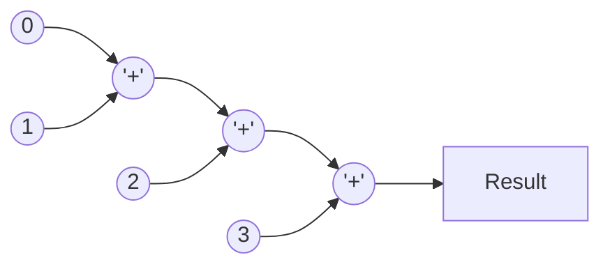

You are a helpful assistance.
Consider that you have a folder structure like the following:

    - rtl/*   : Contains files which are RTL code.
    - verif/* : Contains files which are used to verify the correctness of the RTL code.
    - docs/*  : Contains files used to document the project, like Block Guides, RTL Plans and Verification Plans.

When generating files, return the file name in the correct place at the folder structure.

You are solving a 'Specification to RTL Translation' problem. To solve this problem correctly, you should only respond with the RTL code translated from the specification.

Provide me one answer for this request: Develop a System Verilog module that implements a cascaded adder. This module named `cascaded_adder` performs the summation of multiple input data elements, synchronized to the clock, and supports asynchronous reset functionality. The input data is received as a flattened 1D vector, and the output provides the cumulative sum of all the input elements.

## Parameters:
 - **`IN_DATA_WIDTH` (default = 16):** Specifies the bit-width of each individual input data element.
 - **`IN_DATA_NS` (default = 4):** Defines the number of input data elements to be summed.

## Input Ports:
- `clk`: Clock signal. The design registers are triggered on its positive edge.
- `rst_n`: An active-low asynchronous reset signal. When low, the module is held in a reset state, and both `o_valid` and `o_data` are driven low.
- `i_valid`: An active-high input signal that indicates the availability of valid data for processing. It is assumed to be synchronous to the positive edge of `clk` signal.
- `i_data` [`IN_DATA_WIDTH` * `IN_DATA_NS` - 1 : 0]: Input data provided as a flattened 1D vector. This vector contains `IN_DATA_NS` elements, each `IN_DATA_WIDTH` bits wide. It is assumed to be synchronous to the positive edge of `clk` signal.

## Output Ports:
- `o_valid`: Active-high signal indicating that the output sum has been computed and is ready to be read. It is driven on the rising edge of the `clk`
- `o_data` [(`IN_DATA_WIDTH` + $clog2(`IN_DATA_NS`)) - 1 : 0]: Output data representing the cumulative sum of all input elements. The output width is designed to accommodate the full sum **without overflow**. It is driven on the rising edge of the `clk`

## Functional Description:

### Input Data Structure:
- The input data is a flattened 1D vector `i_data` with a total width of `IN_DATA_WIDTH` * `IN_DATA_NS`. 
- For instance, with `IN_DATA_NS` = 4 and `IN_DATA_WIDTH` = 16, the 64-bit wide `i_data` contains four 16-bit elements.
- The input data is latched when i_valid is asserted, synchronized to the positive edge of the clock.

### Cascaded Addition Process:
- The summation is performed on the registered data in a cascaded manner using combinational logic, where each element is progressively added in sequence to the accumulated total.
- Each stage adds the next element in the sequence to the cumulative result of the previous stages, ultimately producing the final sum.
- The design includes an output register that latches the cumulative result at the positive edge of the clock.

---

----

### Latency:
The module introduces a total latency of two clock cycles. One cycle is added for registering the input data, and another for registering the output sum.
Please provide your response as plain text without any JSON formatting. Your response will be saved directly to: rtl/cascaded_adder.sv.
