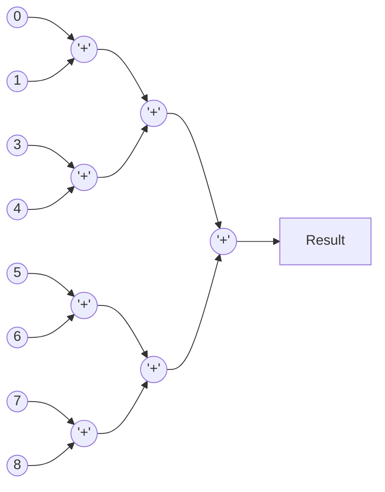

You are a helpful assistance.
Consider that you have a folder structure like the following:

    - rtl/*   : Contains files which are RTL code.
    - verif/* : Contains files which are used to verify the correctness of the RTL code.
    - docs/*  : Contains files used to document the project, like Block Guides, RTL Plans and Verification Plans.

When generating files, return the file name in the correct place at the folder structure.

You are solving an 'RTL Code Completion' problem. To solve this problem correctly, you should only respond with the RTL code generated according to the requirements.


Provide me one answer for this request: Complete the `cascaded_adder` module with a cascaded adder architecture to implement a parallel adder architecture. The parallel design should exploit concurrency by summing input data elements in a tree-like structure, significantly reducing the depth of the addition process and improving performance. The design is synchronized to the positive edge of `clk` and has an active-low asynchronous reset `rst_n` to reset all outputs to zero. `i_valid` and `o_valid` are active high control signals to indicate the availability of a valid input and a valid output. Control signals will be high only for 1 clock cycle, but `o_data` will retain it's computed value until the next computation completes. The input data is received as a flattened 1D vector, and the output provides the cumulative sum of all the input elements. (The input vector contains IN_DATA_NS elements, each IN_DATA_WIDTH bits wide.)

Retain the already written part of the logic unchanged and only complete the adder tree and valid propagation logic of the code based on the specified latency. 

### Parallel Addition Process:
- The input data elements are divided into pairs and summed concurrently at each stage.
- The results from one stage feed into the next stage, progressively reducing the number of partial sums until a single cumulative result is obtained.
- The process follows a binary tree structure, ensuring optimal parallelism.

### Input Requirement:
- The number of input elements (`IN_DATA_NS`) must be a power of two.This ensures a balanced binary tree structure, with each level dividing the inputs evenly into pairs.

### Example Architecture with 8 Elements:

---

----

### Latency:
Design latency is controlled by `REG` It controls whether each intermediate stage in the adder tree will be registered or combinational. Each bit of REG corresponds to one summation stage, starting from the least significant bit (LSB) at the first stage.

- 1: The stage will be registered, introducing a clock cycle latency. (all pairwise additions at this stage will happen parallely in 1 clock cycle)
- 0: The stage will be combinational, with no added latency. (all pairwise additions at this stage will happen combinationally)

### Latency Requirements:
- **Minimum latency**: The minimum latency for `o_valid` should be a fixed latency of **2 clock cycles.** (Example: when `REG = 2'b00` all stages of the adder tree are combinational, input-output latching adds the 2 clock cycle latency.)
- **Maximum latency**: The maximum latency for `o_valid`when all bits of REG are 1, should be **clog2(IN_DATA_NS)+2 clock cycles** (Example: when `REG = 2'b11` all stages registered. There will be a 2 cycle latency for the stages in the adder + 2 cycles for input and output latching)

```verilog 
module cascaded_adder #(
    parameter int IN_DATA_WIDTH = 16,                       // Width of each input data
    parameter int IN_DATA_NS = 4,                           // Number of input data elements
    parameter int NUM_STAGES = $clog2(IN_DATA_NS),          // Number of summation stages (calculated once)
    parameter logic [NUM_STAGES-1:0] REG = {NUM_STAGES{1'b1}}  // Control bits for register insertion
) (
   input  logic clk,
   input  logic rst_n,
   input  logic i_valid, 
   input  logic [IN_DATA_WIDTH*IN_DATA_NS-1:0] i_data,  // Flattened input data array
   output logic o_valid,
   output logic [(IN_DATA_WIDTH+$clog2(IN_DATA_NS))-1:0] o_data // Output data (sum)
);
 
   // Internal signals for the adder tree
   logic [IN_DATA_WIDTH*IN_DATA_NS-1:0] i_data_ff;                             // Flattened input data array register
   logic [IN_DATA_WIDTH-1:0] in_data_2d [IN_DATA_NS-1:0];                      // Intermediate 2D array
   logic [(IN_DATA_WIDTH+$clog2(IN_DATA_NS))-1:0] stage_output [NUM_STAGES-1:0][IN_DATA_NS>>1-1:0];
   logic valid_ff;
   logic valid_pipeline [NUM_STAGES-1:0];  // Pipeline to handle the valid signal latencies based on REG
   
   // Register the input data on valid signal
   always_ff @(posedge clk or negedge rst_n) begin : reg_indata
      if(!rst_n)
         i_data_ff <= 0;
      else begin
         if(i_valid) begin
            i_data_ff <= i_data;
         end
      end
   end

   // Convert flattened input to 2D array
   always_comb begin
       for (int i = 0; i < IN_DATA_NS; i++) begin : conv_1d_to_2d
           in_data_2d[i] = i_data_ff[(i+1)*IN_DATA_WIDTH-1 -: IN_DATA_WIDTH];
       end
   end

   // Insert Code here for parallel logic of the adder tree using generate statements
   

   always_ff @(posedge clk or negedge rst_n) begin
      if(!rst_n)
         valid_ff <= 1'b0;
      else 
         valid_ff <= i_valid;
   end


   // Insert Code here for Valid signal propagation with latency based on REG


   // Assign the final stage of valid_pipeline to o_valid
   always_ff @(posedge clk or negedge rst_n) begin
      if(!rst_n)
         o_valid <= 1'b0;
      else
         o_valid <= valid_pipeline[NUM_STAGES-1];
   end

   // Output data assignment
   always_ff @(posedge clk or negedge rst_n) begin : reg_outdata
      if ( !rst_n) begin
         o_data <= 0 ;
      end else if (valid_pipeline[NUM_STAGES-1]) begin
         o_data <= stage_output[NUM_STAGES-1][0];
      end
   end

endmodule
```
Please provide your response as plain text without any JSON formatting. Your response will be saved directly to: rtl/cascaded_adder.sv.
