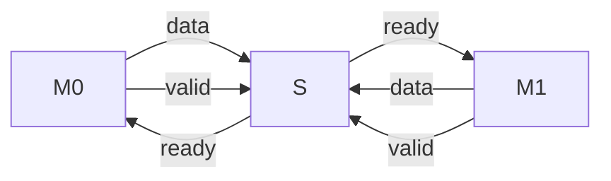

You are a helpful assistance.
Consider that you have a folder structure like the following:

    - rtl/*   : Contains files which are RTL code.
    - verif/* : Contains files which are used to verify the correctness of the RTL code.
    - docs/*  : Contains files used to document the project, like Block Guides, RTL Plans and Verification Plans.

When generating files, return the file name in the correct place at the folder structure.

You are solving a 'Specification to RTL Translation' problem. To solve this problem correctly, you should only respond with the RTL code translated from the specification.


Provide me one answer for this request: Write the RTL design for a data bus controller using System Verilog. Here are the design specifications.
-  There will be two master interfaces (m0 and m1) which can send transaction independently regardless of each other. Both interfaces use ready-valid handshake mechanism. 
- There will be only one slave to accept these transactions. This should also follow the ready-valid handshake mechanism. 
- If both masters drive transaction at different clock cycles, then design should drive them to slave interface first come, first served basis. 
- The ready signal for master should be dependent on slave's ready. Slave's ready signal should be transferred to masters's ready signal.
- If both masters drives at the same cycle, then design should use a parameter named 'AFINITY' value to decide whose transaction will be sent to the slave and whose will be ignored.
  - The parameter AFINITY can only have value 0 and 1
  - if the value of AFINITY is 0 at that particular cycle, the transaction of m0 should be driven to the slave and m1 will be ignored.
  - if the value of AFINITY is 1 at that particular cycle, the transaction of m1 should be driven to the slave and m0 will be ignored.
- Latency of the design should be one cycle.
 Here is the signal description of the interface.

### Global Signals

| Signal Name | Width  | Direction | Description                                                  | 
|-------------|--------|-----------|--------------------------------------------------------------|
| clk         | 1 bit  | input     | System clock                                                 |
| rst_n       | 1 bit  | input     | Asynchronous active low reset                                |

### Master_0 interface (m0):

| Signal Name | Width  | Direction | Description                                                  | 
|-------------|--------|-----------|--------------------------------------------------------------|
| m0_ready    | 1 bit  | output    | Indicates that the design is ready to accept the transaction |
| m0_valid    | 1 bit  | input     | Indicates that this transaction is a valid transaction       |
| m0_data     | 32 bit | input     | Data to be transferred                                       |

### Master_1 interface (m1):

| Signal Name | Width  | Direction | Description                                                  |
|-------------|--------|-----------|--------------------------------------------------------------|
| m1_ready   | 1 bit  | output    | Indicates that the design is ready to accept the transaction |
| m1_valid    | 1 bit  | input     | Indicates that this transaction is a valid transaction       |
| m1_data     | 32 bit | input     | Data to be transferred                                       |

### Slave interface :

| Signal Name | Width  | Direction | Description                                                  |
|-------------|--------|-----------|--------------------------------------------------------------|
| s_ready     | 1 bit  | input     | Indicates that the slave is ready to accept the transaction  |
| s_valid     | 1 bit  | output    | Indicates that this transaction is a valid transaction       |
| s_data      | 32 bit | output    | Data to be transferred                                       |

Here is the module definition in System Verilog
```SystemVerilog
module data_bus_controller #(
  parameter AFINITY = 0
  )(
  input         clk      ,
  input         rst_n    ,

  output        m0_read  ,
  input         m0_valid ,
  input [31:0]  m0_data  ,

  output        m1_read  ,
  input         m1_valid ,
  input [31:0]  m1_data  ,

  input         s_read   ,
  output        s_valid  ,
  output [31:0] s_data 
);
```
 ### Conceptual Diagram

### Ready-Valid Handshake Protocol
The ready-valid handshake mechanism is a commonly used protocol in digital designs for managing data transfer between modules in a synchronized and reliable manner. In this protocol, two signals—valid and ready—coordinate the data transfer. The valid signal, asserted by the sender, indicates that the data is ready to be transmitted. The ready signal, asserted by the receiver, indicates that it is prepared to accept the data. A successful handshake occurs when both valid and ready are high in the same clock cycle, enabling the data transfer. This mechanism ensures data is transferred only when both modules are synchronized, improving timing predictability and flow control in digital systems.
Please provide your response as plain text without any JSON formatting. Your response will be saved directly to: rtl/data_bus_controller.sv.
