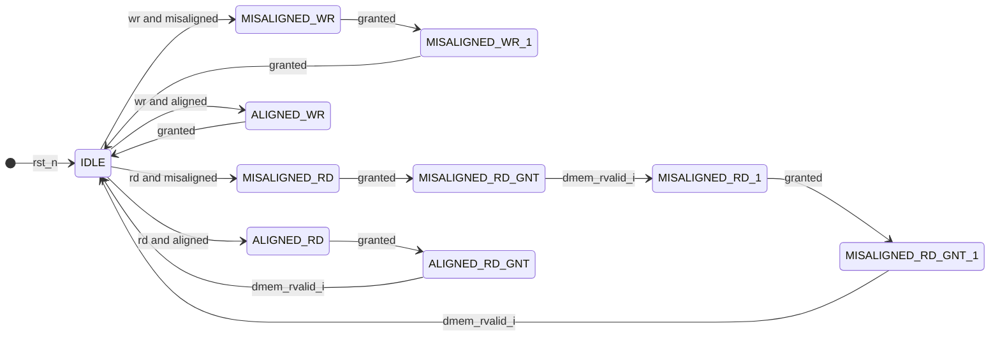

You are a helpful assistance.
Consider that you have a folder structure like the following:

    - rtl/*   : Contains files which are RTL code.
    - verif/* : Contains files which are used to verify the correctness of the RTL code.
    - docs/*  : Contains files used to document the project, like Block Guides, RTL Plans and Verification Plans.

When generating files, return the file name in the correct place at the folder structure.

You are solving an 'RTL Code Modification' problem. To solve this problem correctly, you should only respond with the modified RTL code according to the requirements.


Consider the following content for the file rtl/load_store_unit.sv:
```
module load_store_unit (
    input  logic                 clk,
    input  logic                 rst_n,

    // EX stage interface
    input  logic                 ex_if_req_i,           // LSU request
    input  logic                 ex_if_we_i,            // Write enable: 0 (load), 1 (store)
    input  logic     [ 1:0]      ex_if_type_i,          // Data type: 0x2 (word), 0x1 (halfword), 0x0 (byte)
    input  logic     [31:0]      ex_if_wdata_i,         // Data to write to memory
    input  logic     [31:0]      ex_if_addr_base_i,     // Base address
    input  logic     [31:0]      ex_if_addr_offset_i,   // Offset address
    input  logic                 ex_if_extend_mode_i,
    output logic                 ex_if_ready_o    ,

    
    // Writeback stage interface
    output logic     [31:0]      wb_if_rdata_o,         // Requested data
    output logic                 wb_if_rvalid_o,        // Requested data valid

    // Data memory (DMEM) interface
    output logic                 dmem_req_o,
    input  logic                 dmem_gnt_i,
    output logic     [31:0]      dmem_req_addr_o,
    output logic                 dmem_req_we_o,
    output logic     [ 3:0]      dmem_req_be_o,
    output logic     [31:0]      dmem_req_wdata_o,
    input  logic     [31:0]      dmem_rsp_rdata_i,
    input  logic                 dmem_rvalid_i
    );

  // Internal signals
  logic ex_req_fire;
  logic dmem_req_we_q;
  logic [31:0] data_addr_int;
  logic misaligned_addr;
  logic [3:0] dmem_be, dmem_req_be_q;

  logic busy_q;  
  logic dmem_req_q ;


  
  logic [31:0] dmem_req_wdata_q;
  logic [31:0] dmem_req_addr_q;

  logic [31:0] wb_if_rdata_q;
  logic wb_if_rvalid_q;

  logic [1:0] rdata_offset_q ;
  logic [31:0] rdata_w_ext , rdata_h_ext, rdata_b_ext, data_rdata_ext ;
  logic [1:0] data_type_q ;
  logic data_sign_ext_q ;

  assign data_addr_int = ex_if_addr_base_i + ex_if_addr_offset_i;

  assign ex_req_fire = ex_if_req_i && !busy_q && !misaligned_addr;
  assign ex_if_ready_o = !busy_q;


  always_comb begin
    misaligned_addr = 1'b0;
    dmem_be = 4'b0000;
    case (ex_if_type_i)  
      2'b00: begin  
          case (data_addr_int[1:0])
            2'b00:   dmem_be = 4'b0001;
            2'b01:   dmem_be = 4'b0010;
            2'b10:   dmem_be = 4'b0100;
            2'b11:   dmem_be = 4'b1000;
            default: dmem_be = 4'b0000;
          endcase
      end

      2'b01: begin  
          case (data_addr_int[1:0])
            2'b00:   dmem_be = 4'b0011;
            2'b10:   dmem_be = 4'b1100;
            default: begin
                dmem_be = 4'b0000;
                misaligned_addr = 1'b1;
            end
          endcase
      end

      2'b10: begin  
          case (data_addr_int[1:0])
            2'b00:   dmem_be = 4'b1111;
            default: begin
                dmem_be = 4'b0000;
                misaligned_addr = 1'b1;
            end
          endcase
      end
      default: begin
          dmem_be = 4'b0000;
          misaligned_addr = 1'b1;
      end 
    endcase
  end

  
  always_ff @(posedge clk, negedge rst_n) begin
    if (!rst_n) begin
      dmem_req_q <= 1'b0;
      dmem_req_addr_q <= '0;
      dmem_req_we_q <= '0 ;
      dmem_req_be_q <= '0 ;
      dmem_req_wdata_q <= '0 ;
      rdata_offset_q <= '0 ;
    end else if (ex_req_fire) begin
      dmem_req_q <= 1'b1;
      dmem_req_addr_q <= data_addr_int;
      dmem_req_we_q <= ex_if_we_i;
      dmem_req_be_q <= dmem_be ;
      dmem_req_wdata_q <= ex_if_wdata_i ; 

      rdata_offset_q <= data_addr_int[1:0] ; 
      data_sign_ext_q <= ex_if_extend_mode_i ;
      data_type_q <= ex_if_type_i ;
    end else if (dmem_req_q && dmem_gnt_i) begin
      dmem_req_q <= 1'b0;  
      dmem_req_addr_q <= '0 ;
      dmem_req_we_q <= '0 ;
      dmem_req_be_q <= '0 ;
      dmem_req_wdata_q <= '0 ;
    end
  end
  
  
  
  always_comb begin
    case (rdata_offset_q)
      2'b00: rdata_w_ext = dmem_rsp_rdata_i[31:0];
      default: rdata_w_ext = '0 ;
    endcase
  end

  always_comb begin
    case (rdata_offset_q)
      2'b00: begin
        if (data_sign_ext_q) rdata_h_ext ={{16{dmem_rsp_rdata_i[15]}}, dmem_rsp_rdata_i[15:0]};
        else rdata_h_ext =  {16'h0000, dmem_rsp_rdata_i[15:0]};
      end

      2'b10: begin
        if (data_sign_ext_q) rdata_h_ext = {{16{dmem_rsp_rdata_i[31]}}, dmem_rsp_rdata_i[31:16]};
        else rdata_h_ext = {16'h0000, dmem_rsp_rdata_i[31:16]}; 
      end

      default: begin
        rdata_h_ext = '0 ;  
      end
    endcase  
  end
  
  always_comb begin
    case (rdata_offset_q)
      2'b00: begin
        if (data_sign_ext_q) rdata_b_ext  = {{24{dmem_rsp_rdata_i[7]}}, dmem_rsp_rdata_i[7:0]}; 
        else rdata_b_ext = {24'h00_0000, dmem_rsp_rdata_i[7:0]};
      end

      2'b01: begin
        if (data_sign_ext_q) rdata_b_ext  = {{24{dmem_rsp_rdata_i[15]}}, dmem_rsp_rdata_i[15:8]}; 
        else rdata_b_ext = {24'h00_0000, dmem_rsp_rdata_i[15:8]};
      end

      2'b10: begin
        if (data_sign_ext_q) rdata_b_ext  = {{24{dmem_rsp_rdata_i[23]}}, dmem_rsp_rdata_i[23:16]}; 
        else rdata_b_ext = {24'h00_0000, dmem_rsp_rdata_i[23:16]};
      end

      2'b11: begin
        if (data_sign_ext_q) rdata_b_ext  = {{24{dmem_rsp_rdata_i[31]}}, dmem_rsp_rdata_i[31:24]}; 
        else rdata_b_ext = {24'h00_0000, dmem_rsp_rdata_i[31:24]};
      end
    endcase  
  end

  always_comb begin
    case (data_type_q)
      2'b00:        data_rdata_ext = rdata_b_ext ;
      2'b01:        data_rdata_ext = rdata_h_ext;
      2'b10:        data_rdata_ext = rdata_w_ext;
      default:      data_rdata_ext = 32'b0;
    endcase  
  end


  always_comb begin : dmem_req
    dmem_req_o        = dmem_req_q;
    dmem_req_addr_o   = dmem_req_addr_q;
    dmem_req_we_o     = dmem_req_we_q;
    dmem_req_be_o     = dmem_req_be_q;
    dmem_req_wdata_o  = dmem_req_wdata_q;
  end

  always_ff @(posedge clk, negedge rst_n) begin
    if (!rst_n) begin
      wb_if_rdata_q   <= 32'b0;
      wb_if_rvalid_q  <= 1'b0;
    end else if (dmem_rvalid_i) begin
      wb_if_rdata_q   <= data_rdata_ext;
      wb_if_rvalid_q  <= 1'b1;
    end else begin
      wb_if_rvalid_q  <= 1'b0;
    end
  end

  assign wb_if_rdata_o =  wb_if_rdata_q;
  assign wb_if_rvalid_o = wb_if_rvalid_q;

  always_ff @(posedge clk, negedge rst_n) begin
    if (!rst_n) begin
      busy_q <= 1'b0;
    end else if (ex_req_fire) begin
      busy_q <= 1'b1;
    end else if (dmem_req_we_q && dmem_gnt_i) begin
      busy_q <= 1'b0;  
    end else if (!dmem_req_we_q && dmem_rvalid_i) begin
      busy_q <= 1'b0;  
    end
  end
  
endmodule
```
Provide me one answer for this request: Modify the `load_store_unit` module to support handling of **address-misaligned accesses**. For load and store operations where the effective address is not naturally aligned to the referenced data type (e.g., aligned to a four-byte boundary for word accesses or a two-byte boundary for halfword accesses), the operation should be performed as **two separate bus transactions** if the data item crosses a word boundary.

### **Requirements**
1. **Scenarios Requiring Two Transactions:**
   - **Word Access (Load/Store):** If the address is not aligned to a four-byte boundary (e.g., `data_addr_int[1:0] != 2'b00`).
   - **Halfword Access (Load/Store):** If the address crosses a word boundary (e.g., `data_addr_int[1:0] == 2'b11`).

2. **Order of Transactions:**
   - For misaligned accesses, the transaction corresponding to the **lower address** must be performed first.
   - The second transaction completes the load or store operation for the remaining part of the data.


3. **Finite State Machine (FSM):**
   - Use an FSM to manage all cases, including aligned and misaligned accesses. Each bus transaction is controlled by the FSM, which determines whether to issue another transaction based on alignment and grant/valid signals from the data memory. The load/store unit must adhere to the existing data cache interface protocol, ensuring that all interactions with the memory subsystem remain compatible. The `load_store_unit` module must ensure that all data cache bus signals are zeroed whenever `dmem_req_o` is deasserted. 

4. **Data Handling:**
   - For misaligned load operations, the Writeback stage receives the raw data directly from the data memory response (dmem_rsp_rdata_i) per transaction.
   - For store operations, It's assumed that the input write data is correctly pre-aligned to match the memory's address boundaries. For example, if the write data is 0xAABBCCDD:
     - Byte 0xAA will be stored at word offset 0x3.
     - Byte 0xBB will be stored at word offset 0x2.
     - Byte 0xCC will be stored at word offset 0x1.
     - Byte 0xDD will be stored at word offset 0x0.
---

### **FSM Description**

Below is the FSM representation to handle all scenarios:



### **FSM State Descriptions**
1. **IDLE:**
   - Default state where the LSU waits for a request from the execute stage.
   - Transitions to either `ALIGNED_WR`, `ALIGNED_RD`, `MISALIGNED_WR`, or `MISALIGNED_RD` based on the type and alignment of the request.

2. **ALIGNED_WR:**
   - Handles single bus transaction for an aligned store.
   - Transitions back to `IDLE` after the grant signal.

3. **ALIGNED_RD:**
   - Handles single bus transaction for an aligned load.
   - Transitions back to `IDLE` after the data memory response (`dmem_rvalid_i`).

4. **MISALIGNED_WR:**
   - Initiates the first bus transaction for a misaligned store.
   - Transitions to `MISALIGNED_WR_1` after the first grant signal.

5. **MISALIGNED_WR_1:**
   - Completes the second bus transaction for a misaligned store.
   - Returns to `IDLE` after the second grant signal.

6. **MISALIGNED_RD:**
   - Initiates the first bus transaction for a misaligned load.
   - Transitions to `MISALIGNED_RD_GNT` after the first grant signal.

7. **MISALIGNED_RD_GNT:**
   - Waits for the first data response (`dmem_rvalid_i`) and transitions to `MISALIGNED_RD_1`.

8. **MISALIGNED_RD_1:**
   - Initiates the second bus transaction for a misaligned load.
   - Transitions to `MISALIGNED_RD_GNT_1` after the second grant signal.

9. **MISALIGNED_RD_GNT_1:**
   - Waits for the second data response (`dmem_rvalid_i`) and transitions back to `IDLE`.

Please provide your response as plain text without any JSON formatting. Your response will be saved directly to: rtl/load_store_unit.sv.
